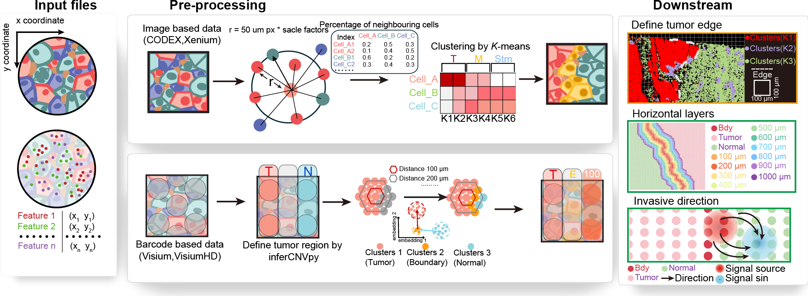

# BoundarySpatial



> A dedicated analytical module for precise tumor edge localization and horizontal exploration of the tumor invasive front in spatial multi-omics data.

##  Overview

BoundarySpatial is a specialized analytical tool designed to address the unique data characteristics of diverse spatial technologies. By integrating molecular expression profiles with spatial coordinates, BoundarySpatial enables:

- **Precise localization** of tumor edge
- **Horizontal exploration** of the tumor invasive front
- **Multi-layer analysis** of spatial tissue organization

##  Key Features

### 🔍 Define Tumor Edge
Accurately identify and delineate tumor edge from surrounding tissue using integrated molecular and spatial information.

### 📊 Horizontal Layers
Analyze tissue architecture through customizable horizontal layer segmentation, enabling detailed examination of spatial gradients and transitions.

### 🧭 Invasive Direction
Determine and quantify the direction of tumor invasion, providing insights into tumor progression and microenvironment interactions.

## Multi-omics platform support

- **In-situ platforms**: Xenium, PCF (R-based)
- **Barcode platforms**: 10x Visium (Python-based)

##  Technology Stack

- **R** - Statistical computing and data visualization
- **Python** - Data processing and algorithm implementation

##  Installation

### Prerequisites
--- Python 3.8 ---
- pandas==2.0.3
- numpy==1.24.4
- GraphST==1.00
- seaborn==0.13.2
- torch==2.4.1+cu124

--- R V4.4 ---
- sf == 1.0.16
- dbscan == 1.1-12
- concaveman == 1.1.0
- dplyr == 1.1.4
- ggplot2 == 3.5.1
### Install from GitHub
```bash
git clone https://github.com/yourusername/BoundarySpatial.git
cd BoundarySpatial
```
## Demo
Demo example

| Platform | Demo File | Format |
|----------|-----------|--------|
| **Visium (Python)** | [BoundarySP_demo.ipynb](./Barcode_platform(Visium)/BoundarySP_demo.ipynb) | Jupyter Notebook |
| **Xenium/PCF (R)** | [02.BoundarySpatial_demo.html](./In_suite_platform(Xenium&PCF)/02.BoundarySpatial_demo.html) | HTML |
| **Invasive direction** | [Invasive_direction_demo.ipynb](./Invasive_direction/Invasive_direction_demo.ipynb) | Jupyter Notebook |


## Quick Start
For Barcode Platforms (Visium) - Python
```python
import os
import scanpy as sc
import scanpy.external as sce
import pandas as pd
import numpy as np
import seaborn as sns
import torch
import matplotlib.pyplot as plt
from GraphST import GraphST
import BoundarySP as bd
import BoundarySP_utility

DATASET_ID = 1
SAMPLE_NAME = "HCC-1L"
H5AD_PATH = f"../Data/{DATASET_ID}_{SAMPLE_NAME}.h5ad"
GTF_FILE = "/data1/huanchangxiang/software/ref/hg38_index/gencode.v46.annotation.gtf"

# Execute preprocessing and spatial domain clustering
adata = bd.pp.preproboundary(type='h5ad',path=H5AD_PATH,library_id='/HCC1/spatial/',n_clusters=5,method="mclust",radius=20)

# Infer CNV profile across spatial spots
adata = bd.pp.bdy_cnv(adata=adata,gtf_file=GTF_FILE,reference_cat='3',reference_key="clusters",resolution=0.4)

# Rank clusters by mean CNV score to validate malignant vs non-malignant status
cnv_summary = (adata.obs.groupby("clusters", observed=False)["cnv_score"].mean().sort_values(ascending=True))
print("=== Mean CNV Scores across Clusters ===")
print(cnv_summary)

# Run BoundaryST propagation algorithm
spatial_res, adata = bd.pp.boundary(data=adata,n_tumor=1,selectcluster="5")
spatial_df = bd.pp.boundary_both(spatial=spatial_res,adata=adata,levels=10)
```
For In-situ Platforms (Xenium/PCF) - R
```r
# Load the BoundarySpatial_in_suite.R script to import all core functions.
library(sf)
library(dplyr)
library(ggplot2)
library(dbscan)
library(concaveman)

# Load the `BoundarySpatial_in_suite.R` script to import all core functions.
source("./BoundarySpatial_in_suite.R")

# input file
"../Data/Breast_alpha_shape.csv"
## Column names: barcode, x, y, Cluster, clusters, cell

run_pipeline(input_path = "../Data/Breast_alpha_shape.csv",
            output_dir = "../Output",
            target_clusters = c("0","1"))
```

For invasive direction
```python
import BoundarySP_invasive_direction as id
import pandas as pd
import scanpy as sc
import os
import numpy as np
import matplotlib.pyplot as plt

# Load spatial transcriptomics data
adata = sc.read_h5ad('../Data/1_HCC-1L.h5ad')

# Calculate LR scores with spatial distance constraint
adata = id.LR_score(
    path="/data1/huanchangxiang/datasets/public_spatial/output/02preprocess/",
    sample="1_HCC-1L",
    distance=500
)

# Load cell group assignments
simu_cell_group = id.input_group(
    group_path="../Data/",
    sample="1_HCC-1L",
    adata=adata
)

# Compute vector field for specific LR pair
results = id.vector_filed(
    adata=simu_cell_group,
    database="CellPhoneDB_v4.0",
    lr_pair=["TGFB1", "TGFBR3"]  # Focus on TGF-beta signaling
)

# Calculate divergence field on a grid
grid_x, grid_y, net_field, U, V = id.calculate_divergence_field_paired(
    results,
    adata=simu_cell_group,
    grid_res=60,  
    sigma=5       
)

# Plot flow field
id.plot_flow(
    adata=simu_cell_group,
    grid_x=grid_x,
    grid_y=grid_y,
    net_field=net_field,
    U=U,
    V=V
)
plt.show()
plt.close()
```
## Authors & Contact
-   **Changxiang Huan** - Lead Developer
-   **Wei Zhang** - Corresponding Atuhor  
-   **Lianqun Zhou** - Corresponding Author  
For questions, bug reports, or collaboration inquiries, please contact the corresponding author:  
📧 **Email**: zhoulq@sibet.ac.cn  
👥 **ORCID**: [ORCID: 0000-0001-9250-7236](https://orcid.org/0000-0001-9250-7236)  
🏫 **Affiliation**: School of Biomedical Engineering (Suzhou), Division of Life Sciences and Medicine, University of Science and Technology of China, Hefei, 230026, China

## License
This project is licensed under the MIT License - see the LICENSE file for details.

